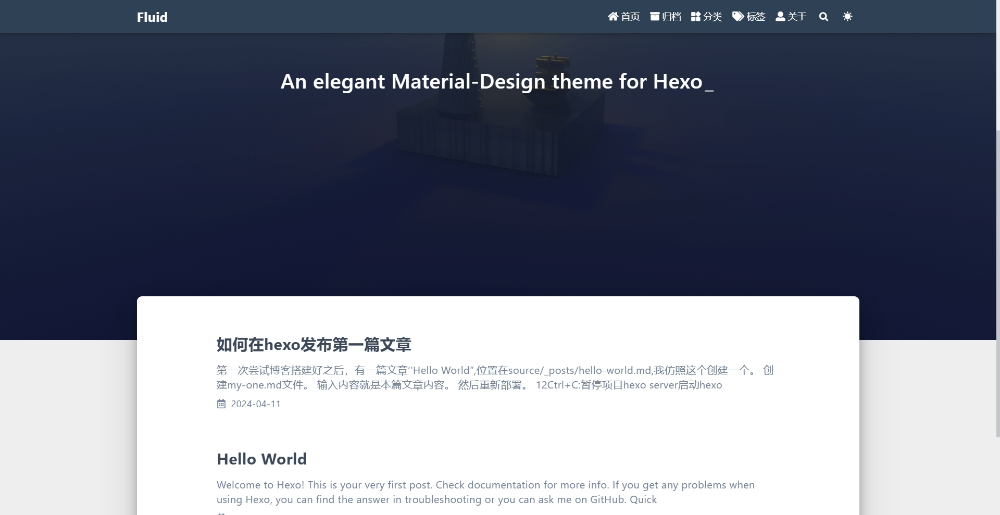

> hexo官网：https://hexo.io/zh-cn/docs/
> fluid主题：https://hexo.fluid-dev.com/docs/

## 搭建原因

有个闲置的小米MIX2，想着用起来，当个服务器，然后安装了aidlux，那要做什么用，就搭建个博客系统吧。

为什么选择hexo呢？

本来想用wordpress，要按照PHP，aidlux应用中心没有，搞个有的，就选择hexo

## 搭建

按照hexo官网操作一下，启动访问没问题。

按照fluid官网安装，替换，重启

然后仿照自带的Hello Worl写个文章2

## 完美

